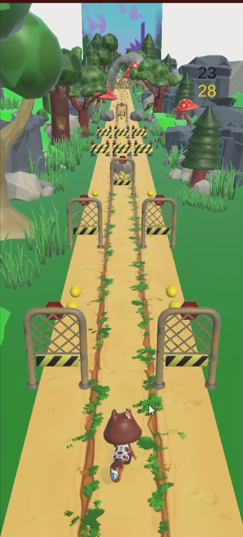

# Endless Runner Team Project

I collaborated with a team consisting of a game designer and 3D artists to develop an Endless Runner game project. As the only developer, I was responsible for programming , implementing the game mechanics and put everything together. Our team used a GDD and a mind map to organize and plan the project, which can be viewed at https://atlas.mindmup.com/kaanksc/trash_run/index.html.

I contributed approximately 20 hours of work to the project, but due to my other commitments, including university and additional projects, I had to withdraw from the team.

## How To Play 
To play the game, the player needs to:
- Swipe left or right to move the character from side to side to avoid obstacles such as barriers, trees, and other obstacles.
- Swipe up to make the character jump over obstacles like barriers or rocks.
- Swipe down to make the character slide under obstacles like low-hanging barriers.
- Collect coins as you run to score points and earn rewards. The more coins you collect, the higher your score will be.
- You can pick up a magnet that collects coins and a shield that avoids the next obstacle.

## About The Project 
The project has three main scenes: Level, Market, and a Main Menu scene. The Level scene includes gameplay, and the Market scene is a shop system template for buying skins and power-ups. The Main Menu navigates to the Level and Market scenes.

### Level Scene 
In the Level scene, the player has the needed scripts for the movement and animations. The game manager object has Tile Manager script that spawns and generates tiles randomly and Player Manager Script that works for the game loop, and there are some other scripts like Audio Manager, etc.

### Market Scene 
The Market scene is a shop system template for buying and changing skins and power-ups.You can add money and subrtuct money with E and F keys .The Market scene has a save system that saves automaticly.Because there is no other models of the character I used other models of our project to represent.

## Preview

  
  
  

  
  

## Assets
Models and textures are made by my team.

DoTwen = [DOTween (HOTween v2)](https://assetstore.unity.com/packages/tools/animation/dotween-hotween-v2-27676)

